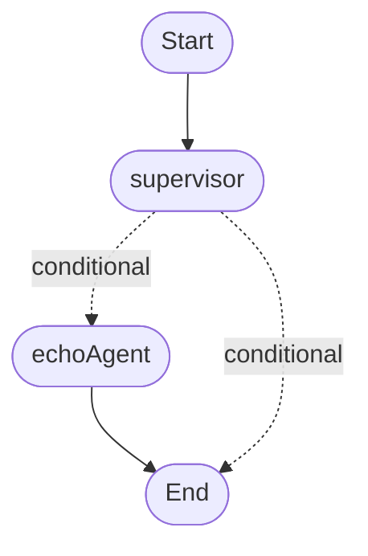

# Agent Graph Documentation

This document describes the structure and flow of the primary agent graph defined in `src/agents/graph.ts`.

## Visual Diagram

The following diagram represents the nodes and edges of the compiled agent graph. It is automatically generated from the source code.

<!-- MERMAID_DIAGRAM_START -->

<!-- MERMAID_DIAGRAM_END -->

## State (`AppState`)

The graph operates on a state object defined by the `AppState` interface.

*   `userInput`: [TODO: Describe purpose]
*   `response`: [TODO: Describe purpose]
*   *Add descriptions for any future state fields.*

## Nodes

The graph consists of the following nodes:

*   **`START`**: The special entry point node.
*   **`supervisor`**: [TODO: Describe purpose and logic of supervisorNode]
*   **`echoAgent`**: [TODO: Describe purpose and logic of echoAgentNode]
*   **`END`**: The special exit point node.

## Flow / Edges

The execution flow follows these connections:

1.  **`START` -> `supervisor`**: The graph always begins execution at the supervisor node.
2.  **`supervisor` -> `echoAgent` (Conditional)**: If the `supervisorNode` determines the next step is `echoAgent`, the flow proceeds here. [TODO: Detail the condition].
3.  **`supervisor` -> `END` (Conditional)**: If the `supervisorNode` determines the flow should end (or doesn't route to `echoAgent`), the graph terminates. [TODO: Detail the condition].
4.  **`echoAgent` -> `END`**: After the `echoAgent` completes, the graph always terminates. 