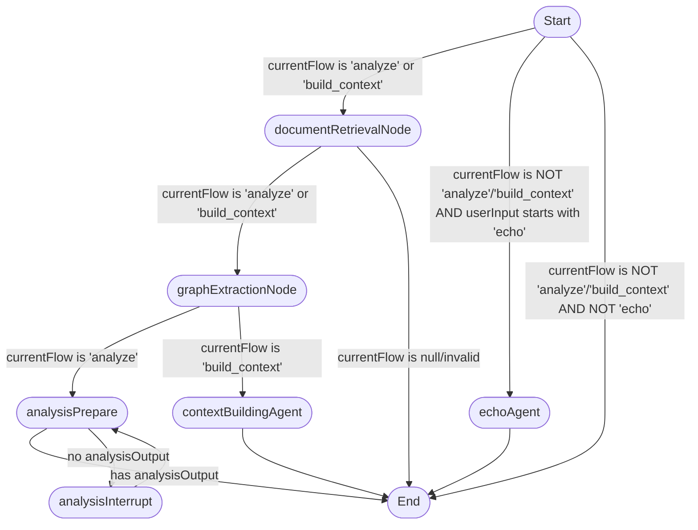

# Agent Graph Documentation

This document describes the structure and flow of the primary agent graph defined in `src/agents/graph.ts`.

## Visual Diagram

The following diagram represents the nodes and edges of the compiled agent graph. The initial routing logic occurs in the conditional edge after the START node and after the documentRetrievalNode.

<!-- MERMAID_DIAGRAM_START -->

<!-- MERMAID_DIAGRAM_END -->

## State (`AppState`)

The graph operates on a state object defined by the `AppState` interface. The state is persisted and updated through graph execution using LangGraph's channels.

### Core Fields
*   `userInput`: The input provided by the user, used for initial routing and processed by agents.
*   `response`: Stores the latest response from the `echoAgent`.
*   `analysisHistory`: Tracks the conversation turns between the user and the analysis agent as an array of `{role: Role, content: string}` objects.
*   `analysisOutput`: Stores the final output generated by the analysis agent upon approval.
*   `currentAnalysisQuery`: Holds the question posed by the analysis agent during an interrupt.
*   `modelName`: The name/ID of the LLM model to use for agent interactions.

### File Input System
*   `inputs`: **Primary field** - Holds a mapping of input file names (basenames) to their string content, populated by the `documentRetrievalNode`.
*   `inputDirectoryPath`: Stores the path to the directory from which input files should be read by `documentRetrievalNode`.
*   `fileContents`: **Legacy field** - Holds the content of files relevant to the analysis task. (Note: This may be deprecated in the future in favor of `inputs`).

### Flow Control
*   `currentFlow`: Indicates the current operational flow, either `'analyze'` or `'build_context'`, guiding conditional routing. Set by command handlers before graph execution.

### Context Building Flow
*   `systemName`: The name of the system or feature for the `build_context` flow.
*   `contextBuilderOutputContent`: Stores the generated content from the `contextBuildingAgentNode`.
*   `contextBuilderOutputFileName`: Stores the target filename for the context overview.

### System Context & Memory Management
*   `system_context`: **MemoryState | null** - Contains the persistent system memory including entities and relationships from previous sessions. This field:
    - Is loaded from the memory file at the start of each command execution
    - Is updated by agent nodes during LLM interactions when new entities/relationships are discovered
    - Contains the knowledge graph data structure (entities and relationships)
    - Is saved back to the memory file at the end of command execution
    - Is managed through the `MemoryService` class but stored as raw `MemoryState` data in the graph state

## Nodes

The graph consists of the following nodes:

*   **`START`**: The special entry point node.
*   **`documentRetrievalNode`**: Reads input files (`.txt`, `.md`) from the directory specified in `AppState.inputDirectoryPath` and populates `AppState.inputs` with their content (filename: content). Warns and skips unreadable files. **Critical for both analyze and build-context flows.**
*   **`graphExtractionNode`**: **Knowledge graph extraction agent** that processes document content to extract entities and relationships using LangChain's `LLMGraphTransformer`. Operates on `AppState.inputs` and:
    - Uses the configured LLM model from `AppState.modelName`
    - Converts documents to LangChain `Document` objects with metadata
    - Extracts knowledge graphs using `LLMGraphTransformer` with strict mode enabled
    - Maps extracted nodes to Archie `Entity` objects (normalizing names, handling properties)
    - Maps extracted relationships to Archie `Relationship` objects
    - Updates the system memory via `MemoryService.addOrUpdateEntity()` and `addOrUpdateRelationship()`
    - Serializes updated memory to `AppState.system_context`
    - Handles errors gracefully with console warnings, never failing the flow
    - **Critical for knowledge accumulation in both analyze and build-context flows.**
*   **`echoAgent`**: Simple agent for echoing input. Used for testing the graph routing.
*   **`analysisPrepare`**: **Complex conversational agent** for the 'analyze' flow. Handles:
    - LLM interactions with system prompt injection
    - Memory context integration - reads from `AppState.system_context` to provide historical knowledge to the LLM
    - Structured LLM response parsing to extract entities and relationships
    - Memory updates - processes LLM responses to update the system knowledge graph
    - User conversation management and approval checking
    - Reads inputs from `AppState.inputs` (file content)
    - Updates `AppState.system_context` with new knowledge discovered during analysis
*   **`analysisInterrupt`**: Triggers the pause (`interrupt`) to wait for user input during analysis. Part of the Human-in-the-Loop (HITL) pattern.
*   **`contextBuildingAgent`**: **Single-pass agent** for the 'build_context' flow. Generates a system context overview using an LLM based on `AppState.inputs` and `AppState.systemName`. Like `analysisPrepare`, it:
    - Integrates memory context from `AppState.system_context`
    - Processes structured LLM responses to extract entities and relationships
    - Updates `AppState.system_context` with new knowledge
    - Populates `AppState.contextBuilderOutputContent` and `AppState.contextBuilderOutputFileName`
*   **`END`**: The special exit point node.

## Flow / Edges

The execution flow follows these connections:

1.  **`START` -> Conditional Routing**: The graph's execution begins by evaluating the `AppState.currentFlow` property. This property is typically set by the calling command handler based on the initial user command (e.g., an "analyze:..." command would set `currentFlow` to `'analyze'` before invoking the graph).
    *   If `AppState.currentFlow` is `'analyze'` -> `documentRetrievalNode`.
    *   If `AppState.currentFlow` is `'build_context'` -> `documentRetrievalNode`.
    *   Else (if `currentFlow` is not `'analyze'` or `'build_context'`):
        *   If `AppState.userInput` (lowercase) starts with "echo" -> `echoAgent`.
        *   Otherwise -> `END`.
2.  **`documentRetrievalNode` -> `graphExtractionNode`**: After `documentRetrievalNode` retrieves input files (populating `AppState.inputs`), it transitions to `graphExtractionNode` for both `'analyze'` and `'build_context'` flows. If `currentFlow` is not set or invalid, it may route to `END`.
3.  **`graphExtractionNode` -> Conditional Routing**: After `graphExtractionNode` extracts knowledge graphs and updates the system memory, it transitions based on `AppState.currentFlow`:
    *   If `currentFlow` is `'analyze'` -> `analysisPrepare`.
    *   If `currentFlow` is `'build_context'` -> `contextBuildingAgent`.
4.  **`analysisPrepare` -> `analysisInterrupt` (Conditional)**: If `analysisPrepare` completes *without* generating a final `analysisOutput`, it transitions to `analysisInterrupt`.
5.  **`analysisPrepare` -> `END` (Conditional)**: If `analysisPrepare` completes *with* a final `analysisOutput` (e.g., solution approved or an error like missing inputs occurred), the graph terminates.
6.  **`analysisInterrupt` -> `analysisPrepare`**: After resuming from an interrupt, execution always returns to `analysisPrepare` to process the user's input.
7.  **`contextBuildingAgent` -> `END`**: After `contextBuildingAgent` generates the context overview content and filename, the graph terminates. (The actual file persistence happens in the `build-context` command handler after the graph concludes).
8.  **`echoAgent` -> `END`**: After the `echoAgent` completes, the graph always terminates. 

## Memory & Knowledge Graph Integration

The graph implements a sophisticated memory system that persists knowledge across sessions:

### Memory Flow
1. **Command Start**: Memory is loaded from file (via `--memory-file` CLI option) into `AppState.system_context`
2. **During Execution**: Agent nodes (`analysisPrepare`, `contextBuildingAgent`) read existing context to inform LLM prompts
3. **LLM Interaction**: Structured prompts guide the LLM to identify entities and relationships in addition to providing user responses
4. **Response Processing**: Agent nodes parse LLM responses to extract:
   - **Agent Response**: The user-facing answer or question
   - **System Context**: JSON structure containing new/updated entities and relationships
5. **Memory Updates**: Extracted entities and relationships are added/updated in the system memory
6. **Command End**: Updated memory is saved back to file

### Knowledge Graph Structure
The system builds a directed graph where:
- **Entities**: System components (services, databases, APIs, etc.) with name, type, description, tags, and properties
- **Relationships**: Directed edges between entities with type and properties
- **Persistence**: JSON file format (default: `context.json`)
- **Updates**: Merge-based updates preserve existing knowledge while adding new information

## LLM Prompts Configuration

This section details the default LLM prompts used by various agents within the system. These prompts can be overridden using the prompt configuration feature (see `docs/features/config_prompts.md`). All prompts now include system context injection for memory continuity.

### `AnalysisPrepareNode/initial.txt`

*   **Key:** `AnalysisPrepareNode/initial`
*   **Description:** This prompt is used to start an analysis based on initial user input and summaries of relevant files. It asks the LLM to identify the primary goal and ask clarifying questions if needed. **Includes structured output format with `<agent>` and `<system>` sections.**
*   **Parameters:**
    *   `{{fileSummaries}}`: Summaries of the content of input files.
    *   `{{firstUserMessage}}`: The initial query or message from the user.

### `AnalysisPrepareNode/final.txt`

*   **Key:** `AnalysisPrepareNode/final`
*   **Description:** This prompt is used to generate a final analysis summary based on the conversation history and a list of files. The summary should include identified assumptions, main components, discussed alternatives with tradeoffs, a summary of design decisions, and any open questions.
*   **Parameters:**
    *   `{{history}}`: The conversation history between the user and the analysis agent.
    *   `{{fileList}}`: A list of filenames relevant to the analysis.

### `AnalysisPrepareNode/followup.txt`

*   **Key:** `AnalysisPrepareNode/followup`
*   **Description:** This prompt is used to continue an ongoing analysis based on the latest user message in the conversation history and a list of relevant files. It instructs the LLM to ask further clarifying questions or provide analysis as appropriate.
*   **Parameters:**
    *   `{{conversationHistory}}`: The conversation history between user and agent.
    *   `{{fileSummaries}}`: Summaries of the content of input files.

### `ContextBuildingAgentNode/context_build.txt`

*   **Key:** `ContextBuildingAgentNode/context_build`
*   **Description:** This prompt is used to generate a concise markdown context overview for a given system or feature name, based on summarized file contents. The overview should explain the main purpose, key components, and primary interactions or data flows described in the provided files. **Includes structured output format for entity/relationship extraction.**
*   **Parameters:**
    *   `{{systemName}}`: The name of the system or feature for which the context is being built.
    *   `{{fileSummaries}}`: Summaries of the content of input files related to the system/feature.

## System Prompt Injection

All LLM interactions include system prompts that provide:
- **Base system context**: Instructions about the AI's role and behavior
- **Memory context**: Serialized knowledge graph from previous sessions (entities and relationships)
- **Dynamic context**: Current file summaries and conversation state

This ensures continuity across sessions and enables the system to build knowledge over time. 