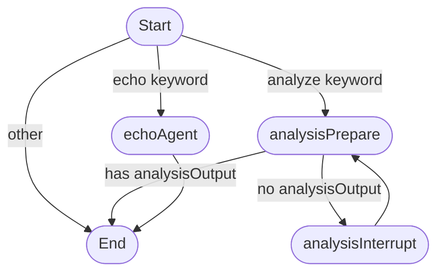

# Agent Graph Documentation

This document describes the structure and flow of the primary agent graph defined in `src/agents/graph.ts`.

## Visual Diagram

The following diagram represents the nodes and edges of the compiled agent graph. The initial routing logic occurs in the conditional edge after the START node.

<!-- MERMAID_DIAGRAM_START -->

<!-- MERMAID_DIAGRAM_END -->

## State (`AppState`)

The graph operates on a state object defined by the `AppState` interface.

*   `userInput`: The input provided by the user, used for initial routing and processed by agents.
*   `response`: Stores the latest response from the `echoAgent`.
*   `fileContents`: Holds the content of files relevant to the analysis task.
*   `analysisHistory`: Tracks the conversation turns between the user and the analysis agent.
*   `analysisOutput`: Stores the final output generated by the analysis agent upon approval.
*   `currentAnalysisQuery`: Holds the question posed by the analysis agent during an interrupt.

## Nodes

The graph consists of the following nodes:

*   **`START`**: The special entry point node.
*   **`echoAgent`**: Simple agent for echoing input.
*   **`analysisPrepare`**: Handles analysis logic, LLM calls, state updates, and checks for completion.
*   **`analysisInterrupt`**: Triggers the pause (`interrupt`) to wait for user input during analysis.
*   **`END`**: The special exit point node.

## Flow / Edges

The execution flow follows these connections:

1.  **`START` -> Conditional Routing**: The graph evaluates the initial `userInput`:
    *   If it contains analysis keywords -> `analysisPrepare`.
    *   If it starts with "echo" -> `echoAgent`.
    *   Otherwise -> `END`.
2.  **`analysisPrepare` -> `analysisInterrupt` (Conditional)**: If `analysisPrepare` completes *without* generating a final `analysisOutput`, it transitions to `analysisInterrupt`.
3.  **`analysisPrepare` -> `END` (Conditional)**: If `analysisPrepare` completes *with* a final `analysisOutput` (e.g., solution approved), the graph terminates.
4.  **`analysisInterrupt` -> `analysisPrepare`**: After resuming from an interrupt, execution always returns to `analysisPrepare` to process the user's input.
5.  **`echoAgent` -> `END`**: After the `echoAgent` completes, the graph always terminates. 