# Archie: Analyze Command Flow

This document details the execution flow of the `analyze` command within the Archie shell, focusing on how the Human-in-the-Loop (HITL) pattern is implemented using LangGraphJS for multi-turn conversational analysis.

## Overview

The `analyze` command allows users to initiate an analysis task by providing an initial query and relevant file paths. The system then enters a conversational loop where an AI agent (represented by LangGraph nodes) interacts with the user, asking clarifying questions until the user approves a proposed solution.

This flow leverages LangGraph's state management, checkpointers, and interrupt mechanism, combined with a specific two-node structure (`AnalysisPrepareNode` and `AnalysisInterruptNode`) identified through troubleshooting as necessary for correct state handling during interrupts.

## Visual Flow Diagram

```mermaid
sequenceDiagram
    participant User
    participant Shell
    participant AnalyzeCommand
    participant AgentGraph
    participant Checkpointer

    User->>Shell: analyze --query "..." --file ...
    Shell->>Shell: parseCommand(input)
    Shell->>AnalyzeCommand: handleAnalyzeCommand(args)
    AnalyzeCommand->>AnalyzeCommand: parseArgs(args)
    AnalyzeCommand->>AnalyzeCommand: readFiles(files)
    AnalyzeCommand->>AnalyzeCommand: Create initial AppState & config (thread_id)
    AnalyzeCommand->>AnalyzeCommand: Start Execution Loop (while !analysisDone)
    AnalyzeCommand->>AnalyzeCommand: analysisIteration(currentInput, config)
    AnalyzeCommand->>AnalyzeCommand: runGraph(currentInput, config)
    AnalyzeCommand->>AgentGraph: app.stream(currentInput, config)
    AgentGraph->>AgentGraph: START -> Evaluate Initial Routing
    Note right of AgentGraph: Based on userInput keywords
    AgentGraph->>AgentGraph: Route -> AnalysisPrepareNode
    AgentGraph->>AgentGraph: Run AnalysisPrepareNode (LLM call, prepare query)
    Note right of AgentGraph: Returns state update (history, query)
    AgentGraph->>Checkpointer: Save State (after Prepare returns)
    AgentGraph->>AgentGraph: Route: AnalysisPrepareNode -> AnalysisInterruptNode
    AgentGraph->>AgentGraph: Run AnalysisInterruptNode
    AgentGraph->>AgentGraph: await interrupt({query: ...})
    Note right of AgentGraph: Graph Pauses
    AgentGraph->>AnalyzeCommand: runGraph returns {interrupted: true, query: ...}
    AnalyzeCommand->>AnalyzeCommand: analysisIteration checks interrupted == true
    AnalyzeCommand->>User: Display Agent Query (via Shell.say)
    User->>AnalyzeCommand: Provide Response (via inquirer)
    AnalyzeCommand->>AnalyzeCommand: Prepare currentInput = Command{resume: response}
    AnalyzeCommand->>AnalyzeCommand: analysisIteration returns {isDone: false, newInput: Command}
    AnalyzeCommand->>AnalyzeCommand: Loop continues with new currentInput
    AnalyzeCommand->>AnalyzeCommand: analysisIteration(currentInput, config)
    AnalyzeCommand->>AnalyzeCommand: runGraph(currentInput, config)
    AnalyzeCommand->>AgentGraph: app.stream(currentInput, config)
    Note left of AgentGraph: Graph Resumes
    AgentGraph->>AgentGraph: interrupt() resolves, returns response
    AgentGraph->>AgentGraph: AnalysisInterruptNode returns {userInput: response}
    AgentGraph->>Checkpointer: Save State (after Interrupt returns)
    AgentGraph->>AgentGraph: Route: AnalysisInterruptNode -> AnalysisPrepareNode
    AgentGraph->>AgentGraph: Run AnalysisPrepareNode
    Note right of AgentGraph: Processes response from state.userInput, adds to history
    
    loop Until User Provides "SOLUTION APPROVED"
        AnalyzeCommand->>AnalyzeCommand: analysisIteration calls runGraph
        AgentGraph->>AgentGraph: Prepare -> Interrupt -> Pause
        AgentGraph->>AnalyzeCommand: runGraph returns {interrupted: true, query: ...}
        AnalyzeCommand->>AnalyzeCommand: analysisIteration handles interrupt
        AnalyzeCommand->>User: Display Agent Query
        User->>AnalyzeCommand: Provide Response
        AnalyzeCommand->>AnalyzeCommand: Prepare Command{resume: ...}
        AnalyzeCommand->>AnalyzeCommand: analysisIteration returns {isDone: false, newInput: Command}
    end

    Note over User, AnalyzeCommand: User eventually provides "SOLUTION APPROVED"
    
    AnalyzeCommand->>AnalyzeCommand: analysisIteration(currentInput, config)
    AnalyzeCommand->>AnalyzeCommand: runGraph(currentInput, config)
    AnalyzeCommand->>AgentGraph: app.stream(currentInput, config)
    AgentGraph->>AgentGraph: Run AnalysisPrepareNode (processes "SOLUTION APPROVED")
    AgentGraph->>AgentGraph: Calls returnFinalOutput
    Note right of AgentGraph: Returns state update {analysisOutput: "..."}
    AgentGraph->>Checkpointer: Save State (after Prepare returns)
    AgentGraph->>AgentGraph: Route: AnalysisPrepareNode -> END
    AgentGraph->>AnalyzeCommand: runGraph returns {interrupted: false}
    AnalyzeCommand->>AnalyzeCommand: analysisIteration checks interrupted == false
    AnalyzeCommand->>AnalyzeCommand: analysisIteration returns {isDone: true, newInput: ...}
    AnalyzeCommand->>AnalyzeCommand: Loop finishes (analysisDone = true)
    AnalyzeCommand->>AgentGraph: app.getState(config)
    AgentGraph->>AnalyzeCommand: Return finalState snapshot
    AnalyzeCommand->>User: Display finalState.values.analysisOutput (via Shell.say)
    AnalyzeCommand->>Shell: handleAnalyzeCommand returns
    Shell->>Shell: Wait for next command
```

## Detailed Step-by-Step Description

1.  **User Invocation (`src/cli/shell.ts`):**
    *   The user types the `analyze` command in the Archie shell.
    *   The `startShell` loop calls `getCommandInput` to read the raw input.
    *   `parseCommand` is called to split the input into the command (`analyze`) and arguments (`args`).
    *   The `switch` statement detects the `analyze` command and calls `handleAnalyzeCommand(args)` from `src/cli/AnalyzeCommand.ts`.

2.  **Preprocessing (`src/cli/AnalyzeCommand.ts`):**
    *   `handleAnalyzeCommand` calls `parseArgs(args)` to extract the `--query` value and `--file` paths.
    *   It calls `readFiles(files)` to read the content of the specified files into the `fileContents` record.
    *   A unique `thread_id` is generated.
    *   The initial `AppState` object is created.
    *   The `config` object containing the `thread_id` is prepared.

3.  **Analysis Execution Loop Start (`handleAnalyzeCommand` in `src/cli/AnalyzeCommand.ts`):**
    *   `handleAnalyzeCommand` initializes `currentInput` with the `initialAppState` and `analysisDone = false`.
    *   It enters a `while (!analysisDone)` loop.
    *   Inside the loop, it calls `await analysisIteration(currentInput, config)`.

4.  **Analysis Iteration (`analysisIteration` in `src/cli/AnalyzeCommand.ts`):**
    *   Calls `await runGraph(currentInput, config)` to execute a step of the agent graph.

5.  **Graph Invocation (`runGraph` in `AnalyzeCommand.ts`):**
    *   `runGraph` calls `agentApp.stream(currentInput, config)`.
    *   Execution enters the LangGraph graph (`src/agents/graph.ts`) at the `START` node.

6.  **Initial Routing (`src/agents/graph.ts` conditional edge from START):**
    *   The conditional edge logic originating from `START` executes.
    *   It examines `state.userInput` (which contains `analyze: <query>`).
    *   It determines the first node is `ANALYSIS_PREPARE`.

7.  **Analysis Preparation (`src/agents/AnalysisPrepareNode.ts`):**
    *   `analysisPrepareNode` executes.
    *   **Input Handling:** Processes `state.userInput` (initial query or resumed input) and adds it to `analysisHistory`.
    *   **Approval Check:** Checks `analysisHistory` for "SOLUTION APPROVED". If found, calls `returnFinalOutput` and returns the final state update, leading eventually to `END`.
    *   **Conversational Turn (If not approved):** Calls LLM placeholder, prepares state update (`analysisHistory`, `currentAnalysisQuery`), and returns it.

8.  **Transition to Interrupt (`src/agents/graph.ts` conditional edge):**
    *   The conditional edge after `ANALYSIS_PREPARE` evaluates the returned state.
    *   If `analysisOutput` is empty, it routes to `ANALYSIS_INTERRUPT`.
    *   The checkpointer saves the state returned by `AnalysisPrepareNode`.

9.  **Interrupt Trigger (`src/agents/AnalysisInterruptNode.ts`):**
    *   `analysisInterruptNode` executes.
    *   Reads `state.currentAnalysisQuery`.
    *   Calls `await interrupt({ query: queryToAsk })` and pauses, waiting for resume.

10. **Handling Interrupt (`runGraph` -> `analysisIteration` in `AnalyzeCommand.ts`):**
    *   The `agentApp.stream` in `runGraph` yields the `__interrupt__` chunk.
    *   `runGraph` returns `{ interrupted: true, agentQuery: queryToAsk }`.
    *   `analysisIteration` receives this result.
    *   Since `interrupted` is true, it displays the `agentQuery` to the user (via `say`).
    *   It uses `inquirer.prompt` to get the `userResponse`.
    *   It prepares the input for the next graph call: `currentInput = new Command({ resume: userResponse })`.
    *   `analysisIteration` returns `{ isDone: false, newInput: currentInput }`.

11. **Loop Continuation (`handleAnalyzeCommand` in `AnalyzeCommand.ts`):**
    *   The main `while` loop receives `{ isDone: false, newInput: Command{...} }`.
    *   It updates `currentInput` with `newInput`.
    *   `analysisDone` remains false, so the loop continues to the next iteration, calling `analysisIteration` again.

12. **Resuming Graph (`analysisIteration` -> `runGraph` -> `AnalysisInterruptNode` -> `graph.ts` edge):**
    *   `analysisIteration` calls `runGraph` with the `Command` object.
    *   `runGraph` calls `agentApp.stream`.
    *   The framework resumes the graph.
    *   The `await interrupt(...)` call in `AnalysisInterruptNode` resolves, returning the `userResponse`.
    *   `AnalysisInterruptNode` captures this and returns `{ userInput: userResponse }`.
    *   The framework updates the `userInput` state channel and the checkpointer saves this state.

13. **Input Processing Cycle (`graph.ts` edge -> `AnalysisPrepareNode`):**
    *   The graph follows the edge `ANALYSIS_INTERRUPT -> ANALYSIS_PREPARE`.
    *   Execution returns to **Step 7** (`AnalysisPrepareNode`), which now receives the user's response via `state.userInput`.

14. **Completion (`AnalysisPrepareNode` -> `END` -> `analysisIteration` -> `handleAnalyzeCommand`):**
    *   Eventually, the user provides "SOLUTION APPROVED".
    *   `AnalysisPrepareNode` detects it, returns the final state update with `analysisOutput` populated.
    *   The conditional edge after `ANALYSIS_PREPARE` routes to `END`.
    *   The `agentApp.stream` call in `runGraph` finishes.
    *   `runGraph` returns `{ interrupted: false, ... }`.
    *   `analysisIteration` receives this result.
    *   Since `interrupted` is false, `analysisIteration` returns `{ isDone: true, newInput: currentInput }`.
    *   The main `while` loop in `handleAnalyzeCommand` receives `{ isDone: true, ... }`.
    *   It sets `analysisDone = true`, ending the loop.
    *   `agentApp.getState(config)` retrieves the final state.
    *   The `analysisOutput` is displayed (via `say`).
    *   `handleAnalyzeCommand` finishes, returning control to the main shell loop in `src/cli/shell.ts`. 