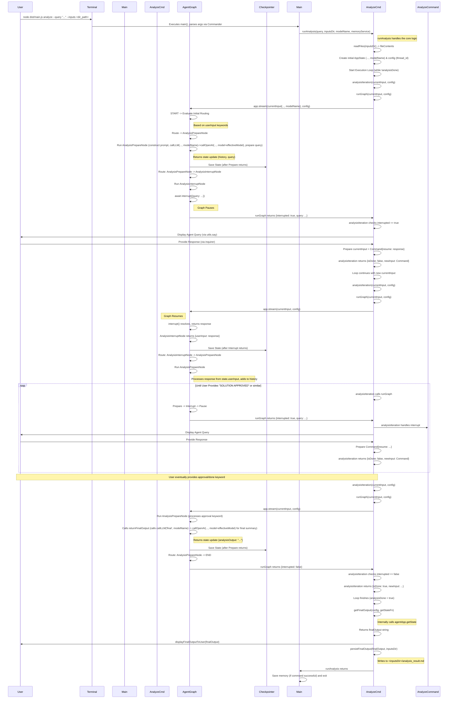

# Archie: Analyze Command Flow

This document details the execution flow of the `analyze` command, focusing on how the Human-in-the-Loop (HITL) pattern is implemented using LangGraphJS for multi-turn conversational analysis.

## Overview

The `analyze` command allows users to initiate an analysis task by providing an initial query (`--query`) and an input directory path (`--inputs`). The system reads relevant files (`.txt`, `.md`) from this directory and then enters a conversational loop where an AI agent interacts with the user via the console, asking clarifying questions until the user approves a proposed solution or indicates they are done. This flow runs directly from the command line after being invoked via `src/main.ts`.

This flow leverages LangGraph's state management, checkpointers, and interrupt mechanism, combined with a specific two-node structure (`AnalysisPrepareNode` and `AnalysisInterruptNode`). The actual LLM interaction happens within `AnalysisPrepareNode` via an abstracted `callLLM` function which utilizes `callOpenAI` from `src/agents/LLMUtils.ts`.

## Visual Flow Diagram

## Detailed Step-by-Step Description

1.  **User Invocation (`src/main.ts`):**
    *   The user runs the application from the terminal, specifying the `analyze` command and its arguments (e.g., `node dist/main.js analyze --query "Implement feature X" --inputs ./docs/feature_x`).
    *   `main.ts`, using `commander`, parses the arguments and identifies the `analyze` command.
    *   The `action` handler for the `analyze` command in `main.ts` calls `runAnalysis(query, inputsDir, modelName, memoryService)` from `src/commands/analyze.ts`.

2.  **Preprocessing (`runAnalysis` in `src/commands/analyze.ts`):**
    *   `runAnalysis` receives the `query`, `inputsDir`, and `modelName`.
    *   It calls `readFiles(inputsDir)` to read the content of `.txt` and `.md` files into the `fileContents` record.
    *   A unique `thread_id` is generated via `newGraphConfigFn`.
    *   The initial `AppState` object is created (`userInput`, `fileContents`, `modelName`, empty `analysisHistory`, etc.).
    *   The `config` object containing the `thread_id` is prepared.

3.  **Analysis Execution Loop Start (`runAnalysis` in `src/commands/analyze.ts`):**
    *   `runAnalysis` initializes `currentInput` with the `initialAppState` and `analysisDone = false`.
    *   It enters a `while (!analysisDone)` loop.
    *   Inside the loop, it calls `await analysisIterationFn(currentInput, config)` (which defaults to the local `analysisIteration` function).

4.  **Analysis Iteration (`analysisIteration` in `src/commands/analyze.ts`):**
    *   Calls `await runGraphFn(currentInput, config)` (which defaults to the local `runGraph`) to execute a step of the agent graph.

5.  **Graph Invocation (`runGraph` in `src/commands/analyze.ts`):**
    *   `runGraph` calls `agentApp.stream(currentInput, config)`.
    *   Execution enters the LangGraph graph (`src/agents/graph.ts`) at the `START` node.

6.  **Initial Routing (`src/agents/graph.ts` conditional edge from START):**
    *   The conditional edge logic examines `state.userInput` (`analyze: <query>`).
    *   It routes execution to the `ANALYSIS_PREPARE` node.

7.  **Analysis Preparation (`src/agents/AnalysisPrepareNode.ts`):**
    *   `analysisPrepareNode` executes.
    *   **Input Handling & Approval Check:** Processes input, adds to history, checks for approval keywords.
    *   **Conversational Turn (If not approved):** Calls `callLLM` (passing history, files, prompt type, `modelName` from state). `callLLM` constructs prompt, calls `LLMUtils.callOpenAI` (passing `modelName`), prepares state update (`analysisHistory`, `currentAnalysisQuery`), and returns it.

8.  **Transition to Interrupt (`src/agents/graph.ts` conditional edge):**
    *   Edge after `ANALYSIS_PREPARE` routes to `ANALYSIS_INTERRUPT` if `analysisOutput` is empty.
    *   Checkpointer saves state.

9.  **Interrupt Trigger (`src/agents/AnalysisInterruptNode.ts`):**
    *   `analysisInterruptNode` reads `state.currentAnalysisQuery`.
    *   Calls `await interrupt({ query: queryToAsk })`, pausing the graph.

10. **Handling Interrupt (`runGraph` -> `analysisIteration` in `src/commands/analyze.ts`):**
    *   `agentApp.stream` yields `__interrupt__`.
    *   `runGraph` returns `{ interrupted: true, agentQuery: queryToAsk }`.
    *   `analysisIteration` receives this.
    *   Displays `agentQuery` (via `utils.say`).
    *   Uses `inquirer.prompt` to get `userResponse`.
    *   Prepares `currentInput = new Command({ resume: userResponse })`.
    *   `analysisIteration` returns `{ isDone: false, newInput: currentInput }`.

11. **Loop Continuation (`runAnalysis` in `src/commands/analyze.ts`):**
    *   The main `while` loop updates `currentInput`.
    *   `analysisDone` remains false, loop continues.

12. **Resuming Graph (`analysisIteration` -> `runGraph` -> `AnalysisInterruptNode` -> `graph.ts` edge):**
    *   The next loop calls `runGraph` with the `Command` object.
    *   `agentApp.stream` resumes.
    *   `interrupt()` call resolves, returning `userResponse`.
    *   `AnalysisInterruptNode` returns `{ userInput: userResponse }`.
    *   Framework updates state, checkpointer saves.

13. **Input Processing Cycle (`graph.ts` edge -> `AnalysisPrepareNode`):**
    *   Edge `ANALYSIS_INTERRUPT -> ANALYSIS_PREPARE` is followed.
    *   Execution returns to **Step 7** (`AnalysisPrepareNode`), processing the user response.

14. **Completion (`AnalysisPrepareNode` -> `END` -> `analysisIteration` -> `runAnalysis`):**
    *   User provides approval keyword.
    *   `AnalysisPrepareNode` detects it, calls `returnFinalOutput` (which calls `callLLM('final', modelName)`), returns state with `analysisOutput` populated.
    *   Edge routes to `END`.
    *   `runGraph` returns `{ interrupted: false, ... }`.
    *   `analysisIteration` returns `{ isDone: true, ... }`.
    *   The `while` loop in `runAnalysis` ends.
    *   `runAnalysis` calls `getFinalOutputFn` (defaults to local `getFinalOutput`, using `getStateFn`).
    *   `runAnalysis` calls `displayFinalOutputFn` (defaults to local `displayFinalOutputToUser`).
    *   `runAnalysis` calls `persistFinalOutputFn` (defaults to local `persistFinalOutput`).
    *   `runAnalysis` finishes, returning control to the `action` handler in `src/main.ts`.
    *   `main.ts` proceeds to save memory (if successful) and then the application exits. 