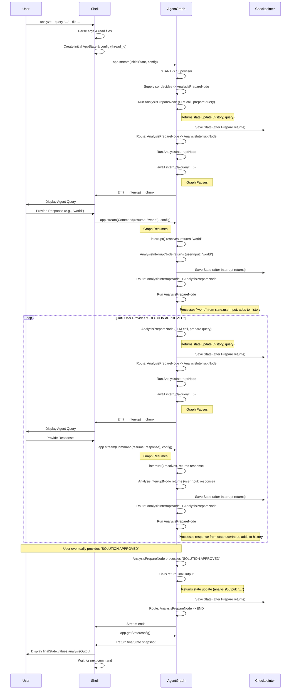

# Archie: Analyze Command Flow

This document details the execution flow of the `analyze` command within the Archie shell, focusing on how the Human-in-the-Loop (HITL) pattern is implemented using LangGraphJS for multi-turn conversational analysis.

## Overview

The `analyze` command allows users to initiate an analysis task by providing an initial query and relevant file paths. The system then enters a conversational loop where an AI agent (represented by LangGraph nodes) interacts with the user, asking clarifying questions until the user approves a proposed solution.

This flow leverages LangGraph's state management, checkpointers, and interrupt mechanism, combined with a specific two-node structure (`AnalysisPrepareNode` and `AnalysisInterruptNode`) identified through troubleshooting as necessary for correct state handling during interrupts.

## Visual Flow Diagram

## Detailed Step-by-Step Description

1.  **User Invocation (`src/cli/shell.ts`):**
    *   The user types the `analyze` command in the Archie shell, providing arguments like `--query "<initial request>"` and `--file <path>`.
    *   The main shell loop parses the input, identifies the `analyze` command, and calls `handleAnalyzeCommand` with the arguments.

2.  **Preprocessing (`handleAnalyzeCommand`):**
    *   Arguments (`--query`, `--file`) are parsed to extract the initial query and file paths.
    *   Specified files are read from the filesystem, and their contents are stored in a `fileContents` record.
    *   A unique `thread_id` is generated using `uuidv4()` for this specific analysis session.
    *   The initial `AppState` is created, populating `userInput` (prefixed with `analyze:`), `fileContents`, and initializing other fields like `analysisHistory` to empty.
    *   The `config` object containing the `thread_id` is prepared.

3.  **Graph Execution Start (`handleAnalyzeCommand` -> `src/agents/graph.ts`):**
    *   The execution loop begins by calling `agentApp.stream(initialAppState, config)`.
    *   Execution enters the LangGraph graph at the `START` node, which immediately transitions to the `SUPERVISOR` node.

4.  **Supervisor Routing (`src/agents/SupervisorNode.ts` & `graph.ts` conditional edge):**
    *   `supervisorNode` runs, examining `state.userInput`.
    *   It detects the "analyze" keyword and decides the next node should be `analysisPrepare`.
    *   The synchronous conditional edge logic in `graph.ts` receives this decision and confirms the route to the `ANALYSIS_PREPARE` node.

5.  **Analysis Preparation (`src/agents/AnalysisPrepareNode.ts`):**
    *   `analysisPrepareNode` executes.
    *   **Input Handling:** It checks `state.userInput`. On the *first* run, it identifies the initial query. On *subsequent* runs (after an interrupt/resume cycle), it identifies the input provided by the user (which was placed into `userInput` by `AnalysisInterruptNode`). It adds the current user input to the `analysisHistory`.
    *   **Approval Check:** It checks if the latest user message in `analysisHistory` contains "SOLUTION APPROVED".
        *   If **YES**: It calls `returnFinalOutput` (which uses the LLM placeholder to generate a final summary), populates `analysisOutput` in the state update, and returns this final state. The graph proceeds to the `END` node via the conditional edge after `ANALYSIS_PREPARE`.
        *   If **NO**: It proceeds to the conversational turn.
    *   **Conversational Turn:**
        *   It formats a prompt including the current `analysisHistory` and `fileContents`.
        *   It calls the (placeholder) LLM to get the agent's next response or question.
        *   It prepares a state update object containing the new agent message for `analysisHistory`, the agent's response/question for `currentAnalysisQuery`, and clears `userInput`.
        *   It **returns** this state update object.

6.  **Transition to Interrupt (`src/agents/graph.ts` conditional edge):**
    *   The graph evaluates the conditional edge after `ANALYSIS_PREPARE`.
    *   Since `state.analysisOutput` is empty (solution not approved), the condition returns `ANALYSIS_INTERRUPT`.
    *   The state update returned by `AnalysisPrepareNode` is processed by the framework's channel reducers, and the checkpointer (`MemorySaver`) saves this updated state.

7.  **Interrupt Trigger (`src/agents/AnalysisInterruptNode.ts`):**
    *   `analysisInterruptNode` executes.
    *   It reads `state.currentAnalysisQuery` (which was just set by `AnalysisPrepareNode`).
    *   It calls `await interrupt({ query: queryToAsk })`.
    *   The LangGraph framework emits an `__interrupt__` signal containing the `queryToAsk`.
    *   Graph execution pauses, waiting for a resume command.
    *   Crucially, `analysisInterruptNode` **waits** at the `await interrupt(...)` line.

8.  **User Interaction (`src/cli/shell.ts`):**
    *   The `handleAnalyzeCommand` loop detects the `chunk.__interrupt__` signal.
    *   It extracts the `agentQuery` from the interrupt data.
    *   It displays the query to the user using `console.log`.
    *   It uses `inquirer.prompt` to wait for and capture the user's typed response.

9.  **Resuming Execution (`src/cli/shell.ts` -> `AnalysisInterruptNode`):**
    *   The shell creates `currentInput = new Command({ resume: userResponse })`.
    *   The loop continues and calls `agentApp.stream(currentInput, config)` again.
    *   The LangGraph framework receives the `Command`, identifies the paused thread using the `config` (`thread_id`).
    *   The `await interrupt(...)` call inside the still-active `analysisInterruptNode` resolves, returning the `userResponse` value.
    *   `analysisInterruptNode` captures this `resumedUserInput`.
    *   It **returns** a state update object: `{ userInput: resumedUserInput }`.

10. **Input Processing Cycle (`src/agents/graph.ts` edge -> `AnalysisPrepareNode`):**
    *   The framework processes the state update returned by `AnalysisInterruptNode`, applying the `resumedUserInput` to the `userInput` channel via its reducer.
    *   The graph follows the defined edge `ANALYSIS_INTERRUPT -> ANALYSIS_PREPARE`.
    *   Execution returns to **Step 5** (`AnalysisPrepareNode`), which now receives the user's latest response in `state.userInput`, allowing the conversation to proceed.

11. **Completion (`AnalysisPrepareNode` -> `END` -> `handleAnalyzeCommand`):**
    *   When the user eventually responds with "SOLUTION APPROVED", `AnalysisPrepareNode` detects it (Step 5b), returns the final state with `analysisOutput` populated.
    *   The conditional edge after `ANALYSIS_PREPARE` routes to `END`.
    *   The `agentApp.stream` call in `handleAnalyzeCommand` finishes without emitting further `__interrupt__` signals.
    *   The `else` block in the shell loop is entered, breaking the `while` loop.
    *   `agentApp.getState(config)` is called to retrieve the final state snapshot.
    *   The content of `finalState.values.analysisOutput` is displayed to the user.
    *   The shell returns to waiting for the next command. 