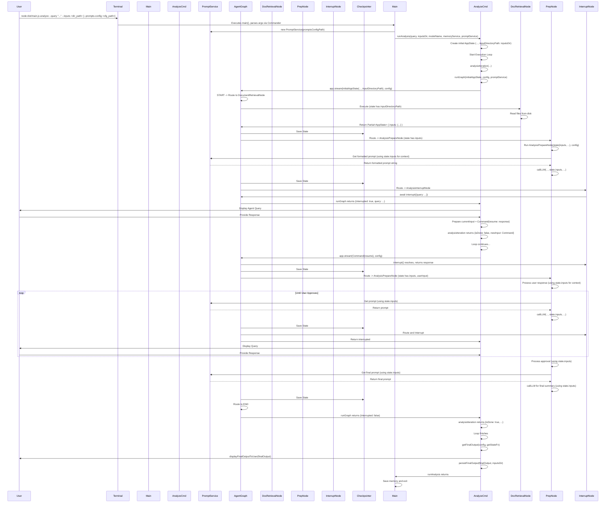

# Archie: Analyze Command Flow

This document details the execution flow of the `analyze` command, focusing on how the Human-in-the-Loop (HITL) pattern is implemented using LangGraphJS for multi-turn conversational analysis.

## Overview

The `analyze` command allows users to initiate an analysis task by providing an initial query (`--query`) and an input directory path (`--inputs`). Optionally, a `--prompts-config <path>` can be provided to customize agent prompts. The `analyze.ts` command module sets the `inputDirectoryPath` in the initial `AppState`. The agent graph, specifically the `documentRetrievalNode`, then reads relevant files (`.txt`, `.md`) from this path and stores their content in `AppState.inputs`. Subsequently, the graph enters a conversational loop where an AI agent (starting with `analysisPrepareNode`, which now reads from `AppState.inputs`) interacts with the user via the console, asking clarifying questions until the user approves a proposed solution or indicates they are done. This flow runs directly from the command line after being invoked via `src/main.ts`.

This flow leverages LangGraph's state management, checkpointers, and interrupt mechanism, combined with a node structure including `documentRetrievalNode`, `AnalysisPrepareNode`, and `AnalysisInterruptNode`. The actual LLM interaction happens within `AnalysisPrepareNode`. This node now uses an injected `PromptService` (passed via `config.configurable` from `runGraph` in `analyze.ts`) to get formatted prompt strings and uses `AppState.inputs` for file-related context. The `PromptService` handles loading default prompts or custom prompts specified in the user-provided configuration file. The `callLLM` function within `AnalysisPrepareNode` then uses this formatted prompt when calling `callOpenAI` from `src/agents/LLMUtils.ts`.

## Visual Flow Diagram

## Detailed Step-by-Step Description

1.  **User Invocation (`src/main.ts`):**
    *   The user runs the application from the terminal, specifying the `analyze` command and its arguments (e.g., `node dist/main.js analyze --query "Implement feature X" --inputs ./docs/feature_x`). They may optionally include `--prompts-config <path_to_config.json>`.
    *   `main.ts`, using `commander`, parses the arguments and identifies the `analyze` command and global options.
    *   `PromptService` is instantiated, passing the `promptsConfigPath` (if provided).
    *   The `action` handler for the `analyze` command in `main.ts` calls `runAnalysis(query, inputsDir, modelName, memoryService, promptService)` from `src/commands/analyze.ts`.

2.  **Preprocessing (`runAnalysis` in `src/commands/analyze.ts`):**
    *   `runAnalysis` receives the `query`, `inputsDir`, `modelName`, and the `promptService` instance.
    *   A unique `thread_id` is generated via `newGraphConfigFn`. The `config` object (of type `AppRunnableConfig`) is prepared, initially containing `configurable: { thread_id }`.
    *   The initial `AppState` object is created, including `userInput`, `modelName`, an empty `analysisHistory`, and crucially, `inputDirectoryPath` set to the `inputsDir` provided to `runAnalysis`. `fileContents` and `inputs` are initialized as empty or per their defaults.

3.  **Analysis Execution Loop Start (`runAnalysis` in `src/commands/analyze.ts`):**
    *   `runAnalysis` initializes `currentInput` with the `initialAppState` and `analysisDone = false`.
    *   It enters a `while (!analysisDone)` loop.
    *   Inside the loop, it calls `await analysisIterationFn(currentInput, config, promptService)` (which defaults to the local `analysisIteration` function).

4.  **Analysis Iteration (`analysisIteration` in `src/commands/analyze.ts`):**
    *   Receives `promptService`.
    *   Calls `await runGraphFn(currentInput, config, promptService)` (which defaults to the local `runGraph`) to execute a step of the agent graph.

5.  **Graph Invocation (`runGraph` in `src/commands/analyze.ts`):**
    *   Receives `promptService`.
    *   Crucially, it modifies the passed `config` by adding `promptService` to `config.configurable.promptService`.
    *   `runGraph` calls `agentApp.stream(currentInput, config)`. The `config` now carries the `promptService` instance into the graph execution environment.
    *   Execution enters the LangGraph graph (`src/agents/graph.ts`) at the `START` node.

6.  **Initial Routing (`src/agents/graph.ts` conditional edge from START):**
    *   The conditional edge logic examines `state.userInput` (`analyze: <query>`).
    *   It routes execution to the `documentRetrievalNode`.

7.  **Document Retrieval (`src/agents/DocumentRetrievalNode.ts`):**
    *   `documentRetrievalNode` executes. It receives the `state`.
    *   It reads `state.inputDirectoryPath`.
    *   It reads `.txt` and `.md` files from the directory, handling errors by warning and skipping files.
    *   It populates `state.inputs` with a map of { filename: content }.
    *   The graph then transitions to `ANALYSIS_PREPARE`.

8.  **Analysis Preparation (`src/agents/AnalysisPrepareNode.ts`):**
    *   `analysisPrepareNode` executes. It receives the `state` (which now includes `state.inputs`) and the `config` (of type `AppRunnableConfig`).
    *   It first checks if `state.inputs` is populated. If not (and inputs were expected), it sets an error in `analysisOutput` and transitions to `END`.
    *   It retrieves `promptService` from `config.configurable.promptService`.
    *   **Input Handling & Approval Check:** Processes `state.userInput`