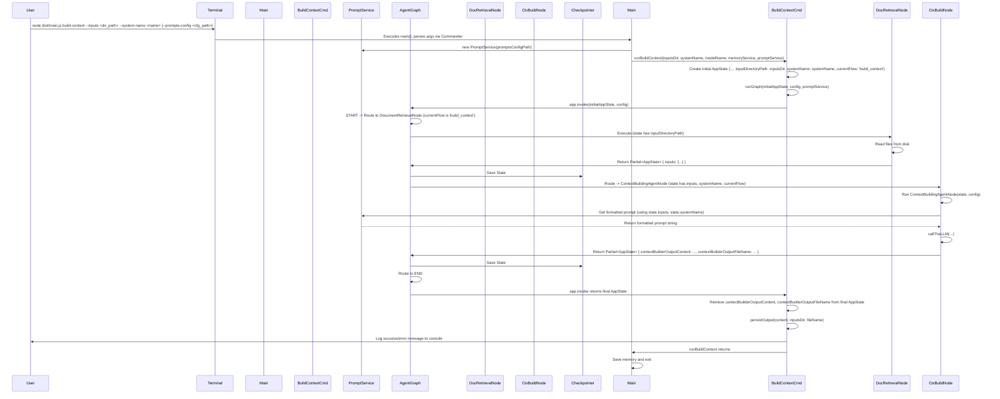

# Archie: Build Context Command Flow

This document details the execution flow of the `build-context` command, explaining how it generates a system context overview.

## Overview

The `build-context` command allows users to generate a contextual overview for a system or feature. It takes an input directory (`--inputs`) containing relevant documents (`.txt`, `.md`) and a system name (`--system-name`). Optionally, a `--prompts-config <path>` can be provided to customize agent prompts. The `buildContext.ts` command module sets the `inputDirectoryPath` and `systemName` in the initial `AppState`, and also sets `currentFlow` to `'build_context'`.

The agent graph then executes: 
1. `documentRetrievalNode`: Reads files from the specified directory and stores their content in `AppState.inputs`.
2. `contextBuildingAgentNode`: Uses the content from `AppState.inputs` and `AppState.systemName` to generate a context summary via an LLM call. It utilizes an injected `PromptService` (passed via `config.configurable` from `runBuildContext` in `buildContext.ts`) to get the appropriate formatted prompt string. The generated summary and the output filename (`<system_name>_context.md`) are stored in `AppState.contextBuilderOutputContent` and `AppState.contextBuilderOutputFileName` respectively.

Unlike the `analyze` command, `build-context` is a single-pass operation without a Human-in-the-Loop (HITL) conversational cycle. After the graph completes, the `runBuildContext` function in `buildContext.ts` retrieves the generated content and filename from the final `AppState` and persists it to a markdown file in the input directory.

## Visual Flow Diagram

## Detailed Step-by-Step Description

1.  **User Invocation (`src/main.ts`):**
    *   The user runs `node dist/main.js build-context --inputs ./docs/my_feature --system-name "MyFeature"`.
    *   `main.ts` parses arguments and identifies the `build-context` command.
    *   `PromptService` is instantiated if `--prompts-config` is provided.
    *   The `action` handler for `build-context` in `main.ts` calls `runBuildContext(inputsDir, systemName, modelName, memoryService, promptService)` from `src/commands/buildContext.ts`.

2.  **Preprocessing (`runBuildContext` in `src/commands/buildContext.ts`):**
    *   `runBuildContext` receives `inputsDir`, `systemName`, `modelName`, and `promptService`.
    *   A `config` object (type `AppRunnableConfig`) is prepared (e.g., with `thread_id`).
    *   The initial `AppState` is created, including `userInput` (e.g., "build_context:"), `modelName`, `inputDirectoryPath` (set to `inputsDir`), `systemName`, and importantly, `currentFlow: 'build_context'`.

3.  **Graph Invocation (`runBuildContext` in `src/commands/buildContext.ts`):**
    *   `runBuildContext` calls `runGraph(initialAppState, config, promptService)` (which defaults to a local `runGraph` function).
    *   The local `runGraph` function adds `promptService` to `config.configurable.promptService`.
    *   It then calls `agentApp.invoke(initialInput, streamConfig)` (note: `invoke` not `stream` as this is a non-streaming, single-pass operation).
    *   Execution enters the LangGraph graph (`src/agents/graph.ts`) at `START`.

4.  **Initial Routing (`src/agents/graph.ts` conditional edge from `START`):**
    *   The logic checks `state.userInput` (e.g., "build_context:") and routes to `documentRetrievalNode`.

5.  **Document Retrieval (`src/agents/DocumentRetrievalNode.ts`):**
    *   `documentRetrievalNode` executes, reads `state.inputDirectoryPath`, and populates `state.inputs` with file contents.

6.  **Conditional Routing after Document Retrieval (`src/agents/graph.ts`):**
    *   The graph checks `state.currentFlow`.
    *   Since `state.currentFlow` is `'build_context'`, it routes to `contextBuildingAgentNode`.

7.  **Context Building (`src/agents/ContextBuildingAgentNode.ts`):**
    *   `contextBuildingAgentNode` executes. It receives the `state` (with `inputs`, `systemName`, `currentFlow`) and `config`.
    *   It retrieves `promptService` from `config.configurable.promptService`.
    *   Validates `state.inputs` and `state.systemName`.
    *   Calls `summarizeFiles(state.inputs)`.
    *   Gets a formatted prompt from `promptService` using context like `state.systemName` and `fileSummaries`.
    *   Calls `callTheLLM` with the prompt to get the context overview.
    *   Returns a `Partial<AppState>` with `contextBuilderOutputContent` set to the LLM response and `contextBuilderOutputFileName` set to `"<systemName>_context.md"`.

8.  **Graph Termination:**
    *   The graph flows from `contextBuildingAgentNode` to `END`.
    *   The `agentApp.invoke()` call in `runBuildContext` returns the final `AppState`.

9.  **Output Persistence (`runBuildContext` in `src/commands/buildContext.ts`):**
    *   `runBuildContext` retrieves `contextBuilderOutputContent` and `contextBuilderOutputFileName` from the returned final `AppState`.
    *   It calls the shared `persistOutput` utility: `persistOutput(content, inputsDir, fileName)`.
    *   Success or error is logged to the console.

10. **Completion (`src/main.ts`):**
    *   `runBuildContext` returns.
    *   `main.ts` saves memory state (if applicable) and exits. 