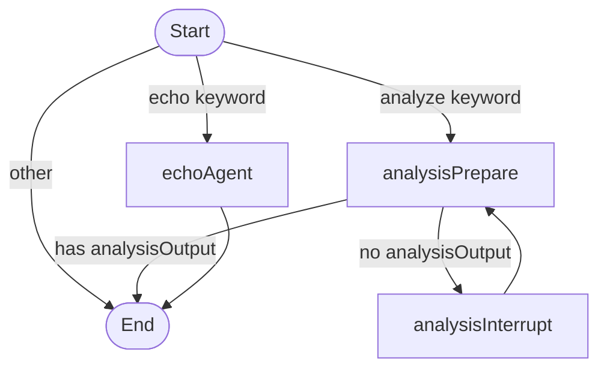

# Archie: CLI Command Execution Flow

## Overview

This document outlines the sequence of events when the Archie application starts and executes a command directly from the command line (e.g., `analyze` or `ask`). It details command-line argument parsing using `commander`, memory loading, command dispatch, execution, and memory saving before termination.

## Sequence Diagram

```mermaid
sequenceDiagram
    participant User
    participant Terminal
    participant main.ts as Main
    participant commander as Commander
    participant MemoryService as Memory
    participant PromptService
    participant analyze.ts as AnalyzeCmd
    participant ask.ts as AskCmd
    participant AgentGraph

    User->>Terminal: node dist/main.js <command> [options/args] [--prompts-config <cfg_path>]
    Terminal->>Main: Executes main()
    Main->>dotenv: config() Loads .env
    Main->>Commander: Instantiates Command()
    Main->>Commander: Defines version, description, global options (--memory-file, --model, --prompts-config)
    Main->>Commander: Defines 'analyze' subcommand with options (optional -q, required -i)
    Main->>Commander: Defines 'ask' subcommand with arguments (<input...>)
    Main->>Commander: parseOptions(process.argv) // Parses global options first
    Commander-->>Main: Returns global options (memoryFile, model, promptsConfigPath)
    Main->>Terminal: Logs "Using model: ...", "Using memory file: ...", "Using prompts config: ..." (if provided)
    Main->>Memory: Instantiates MemoryService()
    Main->>PromptService: Instantiates PromptService(promptsConfigPath)
    Main->>Memory: loadMemory(filePath)
    Memory-->>Main: Memory loaded

    Main->>Commander: await parseAsync(process.argv) // Parses command and executes action

    alt command == "analyze"
        Commander->>Main: Executes analyze action(options)
        Main->>AnalyzeCmd: runAnalysis(options.query, options.inputs, modelName, Memory, PromptService)
        Note over AnalyzeCmd, AgentGraph: Executes analysis flow (potentially interactive via AgentGraph interrupts, using PromptService)
        AnalyzeCmd-->>Main: Analysis completes
    else command == "ask"
        Commander->>Main: Executes ask action(inputParts)
        Main->>AskCmd: runAsk(inputText, modelName, Memory, PromptService)
        Note over AskCmd, AgentGraph: Invokes graph (using PromptService)
        AskCmd->>AgentGraph: invoke({ userInput: inputText, ... }, config{configurable.promptService})
        AgentGraph-->>AskCmd: Returns final state
        AskCmd->>User: Displays Agent Response
        AskCmd-->>Main: Ask completes
    else // Other commands (e.g., --help, --version, unknown)
        Commander->>Terminal: Handles help/version or shows error
        Commander-->>Main: Parsing completes (no action run)
    end

    alt Recognized command executed successfully
        Main->>Memory: saveMemory()
        Memory-->>Main: Memory saved
        Main->>Terminal: Logs "Memory saved. Application shutting down."
    else No successful command action run
         Main->>Terminal: Logs "Shutting down without saving memory."
    end

    Main->>Terminal: Process ends
```

## Detailed Step-by-Step Description

1.  **Execution Start:**
    *   The user executes the compiled JavaScript entry point from the terminal, providing a command (`analyze` or `ask`) and its specific options/arguments, along with optional global options (e.g., `node dist/main.js analyze -q "Refactor this?" --inputs ./src --model gpt-4 --prompts-config ./my_prompts.json` or `node dist/main.js analyze --inputs ./src --model gpt-4` for default analysis).
    *   Relevant Code: Execution in Terminal.

2.  **Initialization (`src/main.ts`):**
    *   The `main()` async function in [`src/main.ts`](../src/main.ts) is the entry point.
    *   `dotenv.config()` loads environment variables.
    *   Relevant Code: [`main.ts L10-L14`](../src/main.ts#L10-L14) (adjust line numbers based on actual file)

3.  **Command and Option Definition (`src/main.ts`):**
    *   An instance of `Command` from the `commander` library is created.
    *   Global metadata (version, description) and global options (`--memory-file`, `--model`, `--prompts-config`) are defined.
    *   The `analyze` subcommand is defined with its required option (`--inputs`) and optional option (`--query`).
    *   The `ask` subcommand is defined with its required variadic argument (`<input...>`).
    *   Relevant Code: [`main.ts L19-L27`](../src/main.ts#L19-L27) (adjust line numbers)

4.  **Global Option Parsing (`src/main.ts`):**
    *   `program.parseOptions(process.argv)` is called to parse *only* the global options initially. This makes `modelName`, `memoryFilePath`, and `promptsConfigPath` available.
    *   The application logs the model, memory file, and prompts configuration file (if provided) being used.
    *   Relevant Code: [`main.ts L29-L38`](../src/main.ts#L29-L38) (adjust line numbers)

5.  **Service Instantiation and Memory Loading (`src/main.ts`):**
    *   `MemoryService` is instantiated.
    *   `PromptService` is instantiated, passing the `promptsConfigPath` (which can be `undefined`).
    *   `memoryService.loadMemory(memoryFilePath)` is called asynchronously to load the state.
    *   Relevant Code: [`main.ts L16, L39-L42`](../src/main.ts#L16) (adjust line numbers)

6.  **Command Action Definition (`src/main.ts`):**
    *   An `.action(async (options) => { ... })` is attached to the `analyze` command definition. This async function contains the logic to call `runAnalysis` from `src/commands/analyze.ts`, passing the parsed `options.query`, `options.inputs`, the global `modelName`, the `memoryService` instance, and the `promptService` instance.
    *   An `.action(async (inputParts) => { ... })` is attached to the `ask` command definition. This async function joins the `inputParts` array into a single string and calls `runAsk` from `src/commands/ask.ts`, passing the `inputText`, global `modelName`, `memoryService`, and `promptService`.
    *   Relevant Code: [`main.ts L49-L77`](../src/main.ts#L49-L77) (adjust line numbers)

7.  **Command Parsing and Execution (`src/main.ts`):**
    *   `await program.parseAsync(process.argv);` is called. `commander` parses the full command line, identifies the subcommand (`analyze` or `ask`), parses its specific options/arguments, and executes the corresponding `.action()` handler defined in the previous step.
    *   If the command is `analyze`, the `analyze` action runs, calling `runAnalysis`. `runAnalysis` uses the provided `promptService` to manage prompt retrieval (custom or default) for its interactions.
    *   If the command is `ask`, the `ask` action runs, calling `runAsk`. `runAsk` also uses the `promptService` when invoking the agent graph.
    *   If the command is not recognized, or if `--help` or `--version` was used, `commander` handles it directly.
    *   Relevant Code: [`main.ts L80`](../src/main.ts#L80), [`src/commands/analyze.ts`](../src/commands/analyze.ts), [`src/commands/ask.ts`](../src/commands/ask.ts)

8.  **Memory Saving and Shutdown (`src/main.ts`):**
    *   **After** `program.parseAsync` completes, the code checks if a known command (`analyze` or `ask`) was successfully executed.
    *   If yes, `memoryService.saveMemory()` is called asynchronously.
    *   Logs indicate whether memory was saved before the application shuts down.
    *   If no command action was run (e.g., `--help`, error, unknown command), memory is *not* saved.
    *   The `main` function completes, and the Node.js process exits.
    *   Relevant Code: [`main.ts L83-L97`](../src/main.ts#L83-L97) (adjust line numbers)

## Agent Graph Structure

The following diagram illustrates the nodes and edges of the compiled agent graph (`src/agents/graph.ts`) responsible for handling user commands beyond basic shell operations like `exit`.

**Node Descriptions:**

*   **`echoAgent`**: Simple agent that echoes input (for testing).
*   **`analysisPrepare`**: Handles the core logic of the analysis agent, including LLM calls, state preparation, and checking for completion.
*   **`analysisInterrupt`**: Triggers the pause (`interrupt`) to wait for user input during the analysis conversation.
*   **`START` / `END`**: Special nodes representing the graph entry and exit points. The initial routing decision happens in the conditional edge logic originating from `START`. 