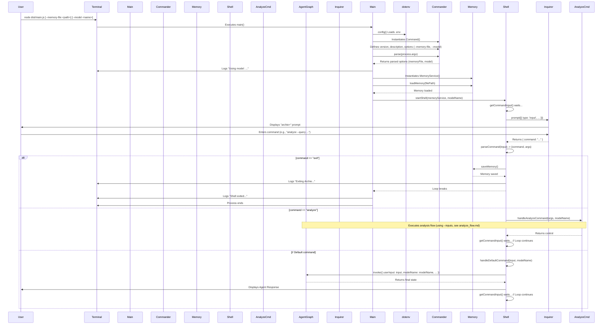

# Archie: Main Program and Shell Initialization Flow

## Overview

This document outlines the sequence of events when the Archie application starts, from command-line execution to the launch of the interactive user shell. It details command-line argument parsing, memory loading, and the initiation of the shell loop.

## Sequence Diagram

## Detailed Step-by-Step Description

1.  **Execution Start:**
    *   The user executes the compiled JavaScript entry point from the terminal, typically `node dist/main.js`.
    *   Optional command-line arguments, like `--memory-file <path>` and `--model <name>`, can be provided.
    *   Relevant Code: Execution in Terminal.

2.  **Initialization (`src/main.ts`):**
    *   The `main()` async function in [`src/main.ts`](../src/main.ts#L14) is the primary entry point.
    *   `dotenv.config()` is called to load environment variables from a `.env` file into `process.env`.
    *   Relevant Code: [`main.ts L7`](../src/main.ts#L7)

3.  **Command-Line Argument Parsing (`src/main.ts`):**
    *   An instance of `Command` from the `commander` library is created.
    *   Application metadata (version, description) and command-line options (specifically `--memory-file` and `--model`) are defined using the `commander` API.
    *   `program.parse(process.argv)` processes the arguments provided by the user in the terminal.
    *   The resolved path for the memory file is determined, defaulting to `./memory.json` if the option isn't provided.
    *   The specified `modelName` is retrieved (or the default is used).
    *   The application logs the model being used (`Using model: ...`).
    *   Relevant Code: [`main.ts L15-L26`](../src/main.ts#L15-L26)

4.  **Memory Service Instantiation and Loading (`src/main.ts`):**
    *   An instance of `MemoryService` is created. This service manages the application's knowledge graph state.
    *   The `memoryService.loadMemory(memoryFilePath)` method is called asynchronously. This attempts to read and parse the JSON data from the specified file path. If the file doesn't exist, it initializes an empty memory state.
    *   Relevant Code: [`main.ts L12`](../src/main.ts#L12), [`main.ts L29-L30`](../src/main.ts#L29-L30)

5.  **Starting the Interactive Shell (`src/main.ts` -> `src/cli/shell.ts`):**
    *   The `startShell(memoryService, modelName)` function from [`src/cli/shell.ts`](../src/cli/shell.ts) is called asynchronously, passing the initialized `MemoryService` instance and the selected `modelName`.
    *   Relevant Code: [`main.ts L33`](../src/main.ts#L33)

6.  **Shell Loop (`src/cli/shell.ts`):**
    *   `startShell` enters an infinite `while(true)` loop.
    *   Inside the loop, `inquirer.prompt` is used to display the `archie>` prompt to the user and wait for input.
    *   Relevant Code: [`shell.ts L7-L15`](../src/cli/shell.ts#L7-L15)

7.  **Handling User Input (`src/cli/shell.ts`):**
    *   The `startShell` loop calls `getCommandInput()` which uses `inquirer` to get the raw command string.
    *   `parseCommand(commandInput)` is called to split the raw string into a lowercase `command` and an array of `args` (handling quoted arguments).
    *   A `switch` statement directs execution based on the `command`:
        *   **`exit`:** Saves memory via `memoryService.saveMemory()`, logs messages, and breaks the loop, causing `startShell` to return.
        *   **`analyze`:** Calls `handleAnalyzeCommand(args, modelName)` from `src/cli/AnalyzeCommand.ts`, passing the arguments and the selected model name. This delegates the entire analysis workflow. Control returns to the shell loop after `handleAnalyzeCommand` completes.
        *   **Default:** For any other command, `handleDefaultCommand(commandInput, modelName)` is called. This function prepares a basic initial state (including `userInput` and `modelName`) and calls `agentApp.invoke()` for a single, non-interactive graph execution, displaying the result.
    *   The shell loop continues, prompting for the next command unless `exit` was entered.
    *   Relevant Code: [`shell.ts`](../src/cli/shell.ts) (main loop, `getCommandInput`, `parseCommand`, `switch` statement)

8.  **Application Shutdown (`src/main.ts`):**
    *   Once the `startShell` function returns (which only happens after the loop is broken by the `exit` command), the `main` function logs "Shell exited. Application shutting down."
    *   The `main` function completes execution. If it finishes successfully, the Node.js process exits cleanly. Error handling is present to catch issues during `main`.
    *   Relevant Code: [`main.ts L36`](../src/main.ts#L36), [`main.ts L39-L42`](../src/main.ts#L39-L42) 

## Agent Graph Structure

The following diagram illustrates the nodes and edges of the compiled agent graph (`src/agents/graph.ts`) responsible for handling user commands beyond basic shell operations like `exit`.

**Node Descriptions:**

*   **`echoAgent`**: Simple agent that echoes input (for testing).
*   **`analysisPrepare`**: Handles the core logic of the analysis agent, including LLM calls, state preparation, and checking for completion.
*   **`analysisInterrupt`**: Triggers the pause (`interrupt`) to wait for user input during the analysis conversation.
*   **`START` / `END`**: Special nodes representing the graph entry and exit points. The initial routing decision happens in the conditional edge logic originating from `START`. 