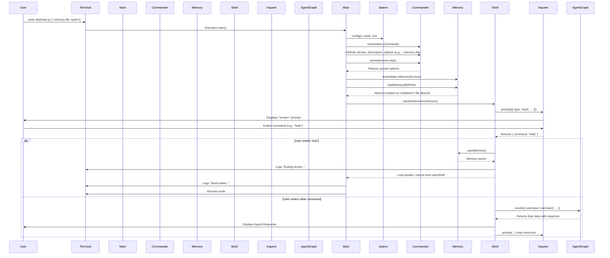

# Archie: Main Program and Shell Initialization Flow

## Overview

This document outlines the sequence of events when the Archie application starts, from command-line execution to the launch of the interactive user shell. It details command-line argument parsing, memory loading, and the initiation of the shell loop.

## Sequence Diagram

## Detailed Step-by-Step Description

1.  **Execution Start:**
    *   The user executes the compiled JavaScript entry point from the terminal, typically `node dist/main.js`.
    *   Optional command-line arguments, like `--memory-file <path>`, can be provided.
    *   Relevant Code: Execution in Terminal.

2.  **Initialization (`src/main.ts`):**
    *   The `main()` async function in [`src/main.ts`](../src/main.ts#L14) is the primary entry point.
    *   `dotenv.config()` is called to load environment variables from a `.env` file into `process.env`.
    *   Relevant Code: [`main.ts L7`](../src/main.ts#L7)

3.  **Command-Line Argument Parsing (`src/main.ts`):**
    *   An instance of `Command` from the `commander` library is created.
    *   Application metadata (version, description) and command-line options (specifically `--memory-file`) are defined using the `commander` API.
    *   `program.parse(process.argv)` processes the arguments provided by the user in the terminal.
    *   The resolved path for the memory file is determined, defaulting to `./memory.json` if the option isn't provided.
    *   Relevant Code: [`main.ts L15-L26`](../src/main.ts#L15-L26)

4.  **Memory Service Instantiation and Loading (`src/main.ts`):**
    *   An instance of `MemoryService` is created. This service manages the application's knowledge graph state.
    *   The `memoryService.loadMemory(memoryFilePath)` method is called asynchronously. This attempts to read and parse the JSON data from the specified file path. If the file doesn't exist, it initializes an empty memory state.
    *   Relevant Code: [`main.ts L12`](../src/main.ts#L12), [`main.ts L29-L30`](../src/main.ts#L29-L30)

5.  **Starting the Interactive Shell (`src/main.ts` -> `src/cli/shell.ts`):**
    *   The `startShell(memoryService)` function from [`src/cli/shell.ts`](../src/cli/shell.ts) is called asynchronously, passing the initialized `MemoryService` instance.
    *   Relevant Code: [`main.ts L33`](../src/main.ts#L33)

6.  **Shell Loop (`src/cli/shell.ts`):**
    *   `startShell` enters an infinite `while(true)` loop.
    *   Inside the loop, `inquirer.prompt` is used to display the `archie>` prompt to the user and wait for input.
    *   Relevant Code: [`shell.ts L7-L15`](../src/cli/shell.ts#L7-L15)

7.  **Handling User Input (`src/cli/shell.ts`):**
    *   The user's input string is received.
    *   **Exit Command:** If the input is `exit` (case-insensitive):
        *   A message "Saving memory..." is logged.
        *   `memoryService.saveMemory()` is called asynchronously to persist the current memory state to the JSON file.
        *   An "Exiting..." message is logged.
        *   The `break` statement exits the `while` loop.
        *   Relevant Code: [`shell.ts L19-L23`](../src/cli/shell.ts#L19-L23)
    *   **Empty Input:** If the input is empty, the loop continues to the next iteration using `continue`.
        *   Relevant Code: [`shell.ts L24-L26`](../src/cli/shell.ts#L24-L26)
    *   **Other Commands:** For any other non-empty input:
        *   The command input is passed as `userInput` in the initial state object to the compiled LangGraphJS agent graph (`agentApp.invoke`).
        *   The agent graph executes based on its defined nodes and edges.
        *   The final response generated by the agent graph (expected in the `response` field of the result state) is logged to the console.
        *   The loop continues, waiting for the next user command.
        *   Relevant Code: [`shell.ts L29-L49`](../src/cli/shell.ts#L29-L49)

8.  **Application Shutdown (`src/main.ts`):**
    *   Once the `startShell` function returns (which only happens after the loop is broken by the `exit` command), the `main` function logs "Shell exited. Application shutting down."
    *   The `main` function completes execution. If it finishes successfully, the Node.js process exits cleanly. Error handling is present to catch issues during `main`.
    *   Relevant Code: [`main.ts L36`](../src/main.ts#L36), [`main.ts L39-L42`](../src/main.ts#L39-L42) 